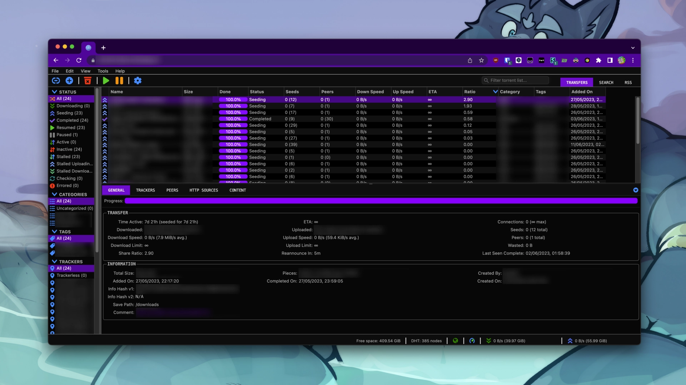

# qBittorrent WebUI Theme



## [📦 UserCSS file ](https://raw.githubusercontent.com/duncannah/qbittorrent-webui-theme/main/qbittorrent-webui-theme.user.css)

This is a custom theme for the qBittorrent WebUI. It modifies the appearance and style of the user interface to provide a personalized and visually appealing experience. Please follow the instructions below to install and apply the theme.

This theme takes the form of an UserCSS stylesheet, which can be applied to the qBittorrent WebUI using the [Stylus](https://add0n.com/stylus.html) browser extension. The theme is built using [Sass](https://sass-lang.com/), which allows for easy customization of the theme.

## Installation

### Step 1: Install the Stylus Extension

1. Install the Stylus browser extension, which allows you to apply custom CSS styles to web pages.

- [Stylus for Chrome](https://chrome.google.com/webstore/detail/stylus/clngdbkpkpeebahjckkjfobafhncgmne)
- [Stylus for Firefox](https://addons.mozilla.org/en-US/firefox/addon/styl-us/)

Other alternatives exist, which might or might not work.

### Step 2: Apply the Theme

1. Click on the "Install directly with Stylus" button above to install the theme.

2. Alternatively, you can download the `qbittorrent-webui-theme.user.css` file from the theme repository and import it into Stylus.

3. If your domain does not match the default, you need to edit the `@document` rule in the theme file to match your domain. For example, if your domain is `localhost:8080`, the rule should be `@document domain("localhost:8080")`.

## Building

To build the qBittorrent WebUI theme, you need to follow these steps:

### Prerequisites

Before proceeding with the installation, ensure that you have the following prerequisites:

- [Node.js](https://nodejs.org) installed on your system.

### Step 1: Download the Theme Files

1. Clone or download the theme repository to your local machine.

    ```shell
    git clone https://github.com/duncannah/qbittorrent-webui-theme.git
    ```

2. Alternatively, you can download the theme as a ZIP file and extract it to a desired location on your computer.

### Step 2: Set Up the Domain

1. Open a terminal or command prompt and navigate to the downloaded theme directory.

    ```shell
    cd qbittorrent-webui-theme
    ```

2. Install the necessary Node.js dependencies by running the following command:

    ```shell
    npm install
    # or
    pnpm install
    ```

3. Once the dependencies are installed, run the script to build the theme files and set the domain for your qBittorrent WebUI. Please provide the domain only, without the protocol (e.g., `localhost:8080`).

    ```shell
    npm run build -- --domain <domain>
    ```

### Step 3: Apply the Theme

0. In Chrome, go to the Extensions page (`chrome://extensions`), and enable the **Allow access to file URLs** option for the Stylus extension.

1. Open a new tab in your browser, and drag the `qbittorrent-webui-theme.user.css` file from the theme directory to the browser window. This will open the Stylus extension and allow you to install the theme.

2. In the Stylus extension, click on the **Install style** button to apply the theme to the qBittorrent WebUI.

## Customization

If you wish to customize the theme further, you can edit the `qbittorrent-webui-theme.user.scss` file in the theme repository. Modify the CSS rules and properties as desired to achieve the desired appearance. After making changes, you need to reapply the theme following the steps mentioned in steps above.

## License

This qBittorrent WebUI theme is licensed under the [MIT License](LICENSE). Feel free to modify and distribute it as per the terms of the license.

## Feedback and Contributions

This theme is provided as-is, I can't guarantee any support or maintenance.

Enjoy your personalized qBittorrent WebUI theme!
